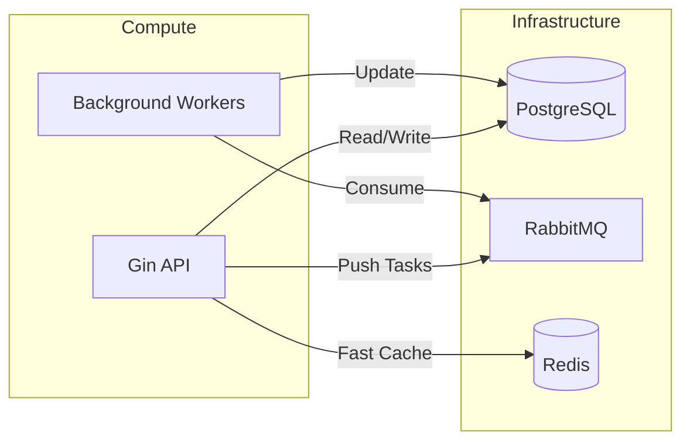
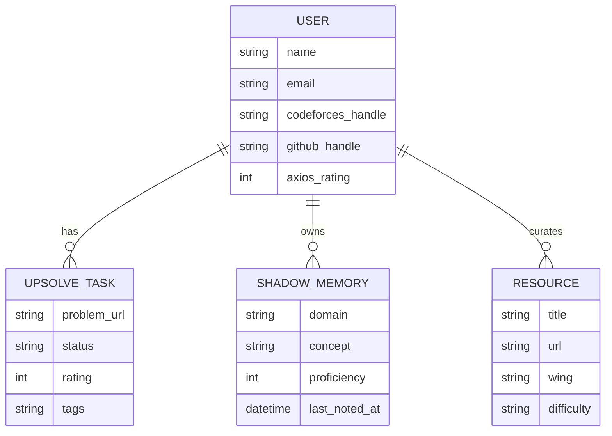

# AXIOS-GO: Deep Technical Architecture

This document provides a comprehensive breakdown of the system design, data flows, and architectural decisions behind AXIOS-GO.

## 1. System Philosophy: The Decoupled Agentic Engine

AXIOS-GO is not a traditional CRUD application. It is an **Agentic Engine** that functions as a "Second Brain" for developers. The architecture is designed to handle high-latency external API calls (GitHub, Codeforces) and heavy LLM reasoning without blocking the user experience.

### 1.1 The "Nexus" Core
The Go backend acts as the "Nexus". It manages:
- **State Persistence**: PostgreSQL.
- **Async Orchestration**: RabbitMQ.
- **Reasoning Routing**: Multi-Provider AI Service.



---

## 2. Component Breakdown

### 2.1 Backend (Go / Gin)
Chosen for its high concurrency and type safety.
- **Middleware Layer**: Implements strict JWT validation and CORS for secure frontend-backend communication.
- **Service Layer**: Decouples business logic from controllers. Each "Wing" has its own service logic.
- **AI Orchestrator**: The central hub for intelligence. It uses **DeepSeek-Reasoner** to decompose complex user prompts into atomic sub-tasks.

### 2.2 Frontend (React / Vite)
A high-performance "Single Page App" (SPA) focused on immersive technical experiences.
- **State Management**: React Context API for lightweight, global authentication state.
- **UI System**: Tailwind CSS for rapid styling + Shadcn/UI for premium components.
- **Visualization**: Three.js and React Three Fiber for 3D technical visualizations (e.g., interactive roadmaps).

---

## 3. Data Flows & Pipelines

### 3.1 The "Upsolve" Pipeline (CP Wing)
This is a critical background process that ensures data freshness.

1. **Scheduler (Cron)**: Every 4 hours, a job triggers in the background.
2. **External Fetch**: The system queries the Codeforces API for all active users.
3. **Filtering**: Logic identifies "Non-OK" verdicts (Wrong Answer, Time Limit Exceeded, etc.).
4. **Queueing**: A message is pushed to **RabbitMQ** for each new task.
5. **Consumption**: A worker consumes the message and performs a deduplicated upsert into the `upsolve_tasks` table.

### 3.2 AI Orchestration Flow
When a user interacts with **CodeSensei**:

1. **Context Loading**: The system fetches the user's "Shadow Memory" (weaknesses) from the DB.
2. **Prompt Engineering**: A complex system prompt is constructed, including the user's technical profile.
3. **Reasoning Step**: DeepSeek analyzes the query and the context to determine the best "Nudge" strategy.
4. **Multi-Model Fallback**: If DeepSeek fails or hits rate limits, the system automatically falls back to **Groq (Llama 3.3 70B)** to ensure high availability.

---

## 4. Database Schema (GORM)

### 4.1 Core Models
- **`User`**: Identity, social handles, and the aggregate **Axios Rating**.
- **`ShadowMemory`**: A concept-based proficiency tracker. Fields: `Domain`, `Concept`, `Proficiency` (1-10), `LastNotedAt`.
- **`UpsolveTask`**: A problem-specific task. Fields: `ProblemURL`, `Rating`, `Status` (pending/solved), `Tags`.
- **`Resource`**: A curated library item. Fields: `Title`, `URL`, `Wing`, `Difficulty`.



---

## 5. Infrastructure & Scalability

### 5.1 Messaging & Caching
- **RabbitMQ**: Ensures that if the Codeforces API is slow or down, the background sync jobs don't crash the main server. Tasks are retried automatically.
- **Redis**: Used for session caching and potentially for rate-limiting in future phases.

### 5.2 Containerization
The entire infrastructure (Redis, RabbitMQ) is containerized via **Docker Compose**, allowing for a "One-Command Setup" (`docker-compose up -d`).

---

## 6. The "Axios" Algorithm
The system calculates a cross-domain rating every 24 hours:
```go
AxiosRating = (normalizedCF * 0.5) + (cfSolved * 5) + (githubRepos * 20) + (githubPRs * 50)
```
This formula is designed to incentivize both deep algorithmic knowledge (CF) and practical engineering output (GitHub).

---
© 2025 AXIOS Technical Nexus.
