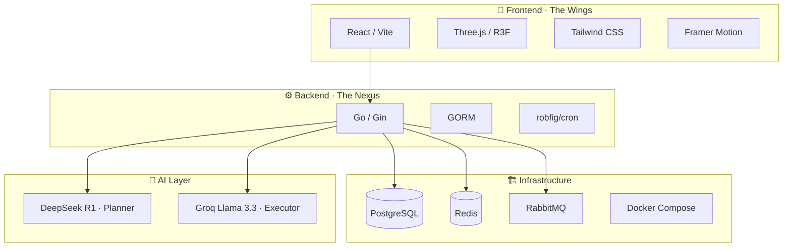
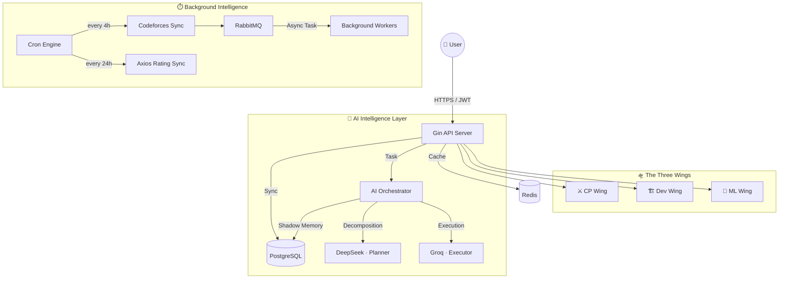
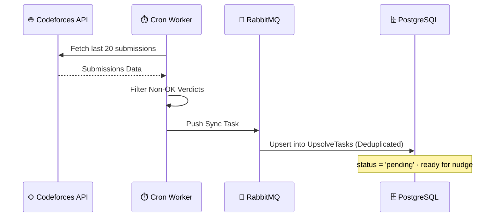
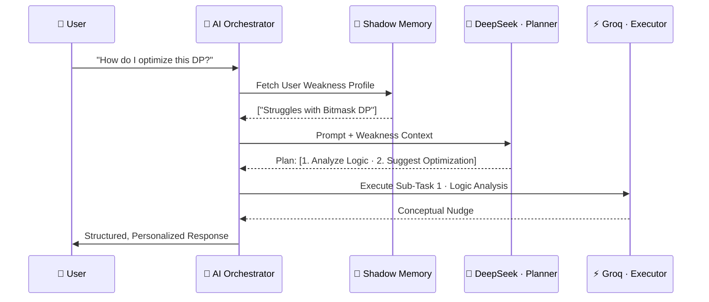

<div align="center">

<br/>

### *Designed & Developed by **Arham***

<br/>

```
 █████╗ ██╗  ██╗██╗ ██████╗ ███████╗      ██████╗  ██████╗ 
██╔══██╗╚██╗██╔╝██║██╔═══██╗██╔════╝     ██╔════╝ ██╔═══██╗
███████║ ╚███╔╝ ██║██║   ██║███████╗     ██║  ███╗██║   ██║
██╔══██║ ██╔██╗ ██║██║   ██║╚════██║     ██║   ██║██║   ██║
██║  ██║██╔╝ ██╗██║╚██████╔╝███████║     ╚██████╔╝╚██████╔╝
╚═╝  ╚═╝╚═╝  ╚═╝╚═╝ ╚═════╝ ╚══════╝      ╚═════╝  ╚═════╝ 
```

### **The Centralized Technical Nexus**

*Competitive Programming · Software Engineering · AI Research — Unified.*

<br/>

[](https://go.dev)
[](https://react.dev)
[](https://postgresql.org)
[](https://redis.io)
[](https://docker.com)
[](https://rabbitmq.com)

<br/>

> *"It doesn't just process requests — it reasons, plans, and remembers."*

<br/>

**Developed by [Mohd Arham Farooqui](https://github.com/)**

</div>

---

<br/>

## ✦ What is AXIOS-GO?

AXIOS-GO is a **production-grade, AI-driven platform** engineered to centralize technical growth across three domains. Built on a **Decoupled Agentic Architecture**, it bridges the gap between competitive programming mastery, software engineering excellence, and AI/ML research — all under one intelligent roof.

The platform doesn't just surface information. It **observes your weaknesses**, **adapts to your skill level**, and **nudges you toward mastery** through a persistent AI memory layer.

<br/>

---

## ✦ The Three Wings

<br/>

<table>
<tr>
<td width="33%" align="center">

### ⚔️ CP Wing
**Competitive Programming**

Automates the *upsolve* pipeline. Every failed Codeforces submission becomes a guided learning opportunity — with AI hints calibrated to your exact weaknesses.

</td>
<td width="33%" align="center">

### 🏗️ Dev Wing
**Software Engineering**

Audits your GitHub repos for health, performs AI-driven PR security reviews, and generates STAR-method resume bullets from your commit history.

</td>
<td width="33%" align="center">

### 🧠 ML Wing
**AI / ML Research**

Generates personalized 3D interactive learning roadmaps that fill the exact gaps in your current technical proficiency.

</td>
</tr>
</table>

<br/>

---

## ✦ Tech Stack



<br/>

---

## ✦ System Architecture

AXIOS-GO separates real-time user interactions from high-latency data synchronization and AI reasoning through a clean **agentic orchestration layer**.



<br/>

---

## ✦ CP Wing · Deep Dive

### The Upsolve Pipeline

Every failed Codeforces submission is automatically captured, deduplicated, and queued for structured review.



### CodeSensei · Logic-Only Nudging

> The AI **never gives you the code.** It gives you the key.

The **CodeSensei** sub-agent analyzes the problem alongside your tracked weaknesses from Shadow Memory. It delivers a *nudge* — just enough insight to unblock your thinking without stealing the breakthrough.

<br/>

---

## ✦ Dev Wing · Deep Dive

### Repo Health Audit

Quantitative analysis of your GitHub presence across three signals:

| Signal | What It Measures |
|--------|-----------------|
| 📄 **README Presence** | Documentation baseline & discoverability |
| 📈 **Activity Frequency** | Commits within the last 30 days |
| 🎯 **Issue Ratio** | Project management and resolution efficiency |

### PR AI Audit

Submit a Pull Request URL → the **Architect sub-agent** fetches the raw diff via GitHub API and performs a full **security + architectural review** *before the PR is merged*.

### STAR Resume Generator

Using commit messages and repository activity, AXIOS-GO generates high-impact bullet points following the **Situation → Task → Action → Result** framework — optimized for technical resumes.

<br/>

---

## ✦ AI Intelligence Layer · The Orchestrator

### Multi-Model Routing Strategy

AXIOS-GO routes tasks intelligently between two specialized models:

| Model | Role | Optimized For |
|-------|------|--------------|
| 🧠 **DeepSeek R1** | Planner | Deep reasoning, task decomposition |
| ⚡ **Groq Llama 3.3** | Executor | Low-latency response generation |

### Task Decomposition Flow



### Shadow Memory Engine

The persistent intelligence layer that makes AXIOS-GO feel like it *knows you*.

```
┌─────────────────────────────────────────────────────────────┐
│                    SHADOW MEMORY ENGINE                      │
├─────────────────────────────────────────────────────────────┤
│  Tracks proficiency (1–10) across technical concepts         │
│                                                             │
│  ┌─────────────┐    ┌──────────────┐    ┌───────────────┐  │
│  │  AI Session │───▶│ Score Update │───▶│ Context Inject│  │
│  │  Upsolve ✓  │    │ +proficiency │    │ into prompts  │  │
│  └─────────────┘    └──────────────┘    └───────────────┘  │
│                                                             │
│  Result: Every AI call is aware of exactly where you are   │
└─────────────────────────────────────────────────────────────┘
```

Every AI interaction and successful upsolve updates your proficiency scores. These scores are injected into *every* AI system prompt — ensuring responses are always calibrated to your current level.

<br/>

---

## ✦ The Axios Rating Algorithm

A unified metric that rewards **cross-disciplinary excellence** — not just grinding one domain.

<br/>

$$\text{AxiosRating} = \underbrace{(CF_{\text{Rating}} \times 0.5)}_{\text{Base Logic}} + \underbrace{(CF_{\text{Solved}} \times 5)}_{\text{Consistency}} + \underbrace{(GH_{\text{Repos}} \times 20)}_{\text{Engineering Output}} + \underbrace{(GH_{\text{PRs}} \times 50)}_{\text{Quality}}$$

<br/>

| Component | Weight | What It Rewards |
|-----------|--------|-----------------|
| `CF_Rating × 0.5` | Base | Raw algorithmic ability |
| `CF_Solved × 5` | Consistency | Problem-solving volume |
| `GH_Repos × 20` | Output | Engineering breadth |
| `GH_PRs × 50` | Quality | Collaborative code impact |

<br/>

---

## ✦ Repository Structure

```
axios-go/
│
├── backend/
│   ├── controllers/        # HTTP entry points · Auth, AI, CP, Dev, ML
│   ├── services/           # Core brain · Orchestrator, Multi-Provider, Integrators
│   ├── workers/            # Cron tasks · RabbitMQ consumers
│   ├── models/             # GORM schemas with auto-migration
│   └── utils/              # JWT · Rating math · Response sanitization
│
└── frontend/
    ├── src/
    │   ├── components/
    │   │   ├── wings/      # CPWing · DevWing · MLWing UI
    │   │   └── 3d/         # Three.js · RoadmapBackground · HeroScene
    │   └── context/        # Auth & Global State management
    └── ...
```

<br/>

---

## ✦ Infrastructure

```
┌──────────────┬──────────────┬──────────────┬──────────────┐
│  PostgreSQL  │   RabbitMQ   │    Redis     │    Docker    │
│              │              │              │   Compose    │
│  Relational  │  Task queue  │  Fast cache  │    Local     │
│  persistence │  for async   │  & sessions  │    infra     │
│              │  background  │              │              │
└──────────────┴──────────────┴──────────────┴──────────────┘
```

<br/>

---

## ✦ User Journeys

### 🎯 Journey 1 · The Silent Mentor

```
[Fail on Codeforces] ──4h──▶ [Appears in Upsolve Queue]
        │
        ▼
  [Click "Get Nudge"]
        │
        ▼
  AI checks Shadow Memory → "Struggles with Segment Trees"
        │
        ▼
  Delivers logic-only hint (no code)
        │
        ▼
  [User solves it] ──▶ Shadow Memory score for "Segment Trees" ↑
```

### 🗺️ Journey 2 · The Technical Evolution Roadmap

```
User: "Give me a roadmap for Frontend + ML"
        │
        ▼
  Orchestrator reads Shadow Memory proficiency scores
        │
        ▼
  Identifies exact knowledge gaps
        │
        ▼
  Generates 12-week personalized plan
        │
        ▼
  Renders as a 3D interactive roadmap in-browser
```

<br/>

---

## ✦ Design Philosophy

```
AESTHETICS    ·  Dark-mode glassmorphism  ·  Neon accents #A855F7 & #22D3EE
MOTION        ·  Framer Motion for seamless, fluid transitions
PERSONA       ·  Elite technical mentor — concise, encouraging, logic-focused
ARCHITECTURE  ·  Decoupled · Agentic · Event-driven · Memory-aware
```

<br/>

---

<div align="center">

<br/>

*Built with precision. Designed for engineers who want to grow fast.*

<br/>

**AXIOS-GO** · Developed by **Mohd Arham Farooqui**

<br/>

</div>
