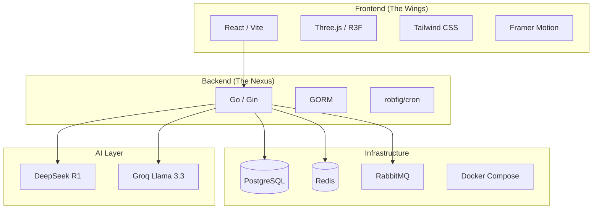
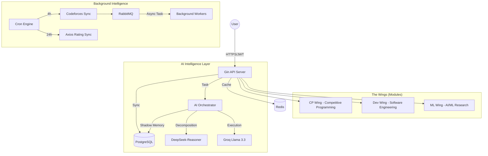
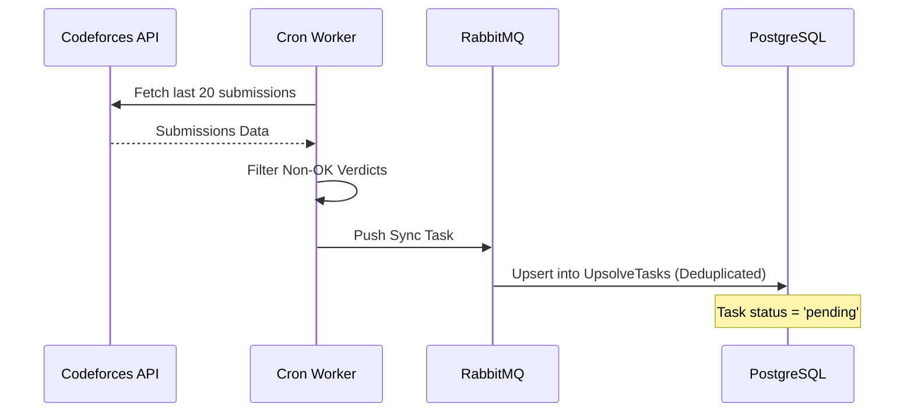
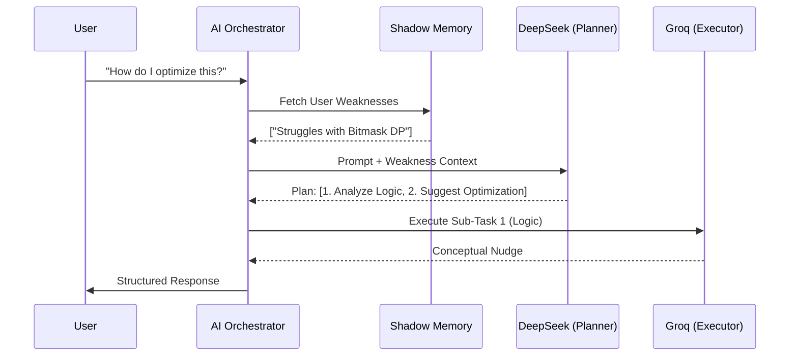

# AXIOS-GO: The Centralized Technical Nexus 🌐

AXIOS-GO is a production-grade, AI-driven platform designed to centralize technical growth. It bridges the gap between competitive programming, software engineering, and AI research through a **Decoupled Agentic Architecture**.

---

## 🛠️ The Tech Stack

## 🏛️ System Design & Architecture

AXIOS-GO is built on the principle of **Agentic Orchestration**. It doesn't just process requests; it reasons, plans, and remembers.

### 1. Global High-Level Flow
The system separates real-time user interactions from high-latency data synchronization and AI reasoning.

---

## 🏎️ CP Wing (Competitive Programming)

The CP Wing is designed to turn failures into growth. It automates the "Upsolving" process.

### 1. The "Upsolve" Pipeline
This flow ensures that every failed submission on Codeforces is tracked and presented as a learning opportunity.

### 2. Logic-Only "Nudging"
To prevent cheating and encourage true learning, the **CodeSensei** sub-agent provides logic-only hints. It analyzes the problem and the user's past weaknesses (from Shadow Memory) to give a "nudge" rather than the code.

---

## 🏗️ Dev Wing (Software Engineering)

The Dev Wing focuses on repository health and professional representation.

### 1. Repo Health Audit
The system performs a quantitative analysis of GitHub repositories based on:
- **README Presence**: Documentation baseline.
- **Activity Frequency**: Commits in the last 30 days.
- **Issue Ratio**: Management efficiency.

### 2. PR AI Audit
Developers can submit a Pull Request URL. The backend fetches the raw diff via the GitHub API and uses the **Architect sub-agent** to perform a security and architectural review before the PR is even merged.

### 3. STAR Resume Generator
Using the **STAR (Situation, Task, Action, Result)** method, AXIOS-GO analyzes recent commit messages and repository activity to generate high-impact bullet points for professional resumes.

---

## 🧠 AI Intelligence Layer: The Orchestrator

AXIOS-GO utilizes a multi-model routing strategy to optimize for reasoning depth and response speed.

### 1. Task Decomposition Flow
When a user asks a complex question (e.g., "How do I optimize my DP for this specific CF problem?"), the **Orchestrator** takes over.

### 2. Shadow Memory Engine
The **Shadow Memory** is a persistent layer that tracks user proficiency (1-10) in technical concepts. 
- **Learning Loop**: Every AI interaction or "Upsolve" success updates the proficiency score.
- **Contextual Injection**: These scores are injected into the system prompt of every AI call, ensuring the AI "knows" exactly where the user is struggling.

---

## 📈 The Axios Rating Algorithm

The Axios Rating is a unified metric that rewards cross-disciplinary excellence.
$$AxiosRating = (CF_{Rating} \times 0.5) + (CF_{Solved} \times 5) + (GH_{Repos} \times 20) + (GH_{PRs} \times 50)$$
- **Base Logic**: Codeforces Rating.
- **Consistency**: Problems Solved.
- **Engineering Output**: GitHub Repositories.
- **Quality**: GitHub Pull Requests.

---

## 📂 Repository blueprint

### Backend (`/backend`)
- **`/controllers`**: HTTP entry points for Auth, AI, CP, Dev, and ML wings.
- **`/services`**: The core "brain"—includes Orchestrator, Multi-Provider routing, and GitHub/Codeforces integrators.
- **`/workers`**: Background `robfig/cron` tasks and RabbitMQ consumers.
- **`/models`**: GORM database schemas with automated migrations.
- **`/utils`**: Shared logic for JWT, rating math, and response sanitization.

### Frontend (`/frontend`)
- **`/src/components/wings`**: Specialized UI for each domain (CPWing, DevWing, MLWing).
- **`/src/components/3d`**: Three.js visualizations (RoadmapBackground, HeroScene).
- **`/src/context`**: Auth and Global State management.

---

## 🛠️ Infrastructure Stack

- **Primary DB**: PostgreSQL (Relational data persistence).
- **Messaging**: RabbitMQ (Task queue for background sync).
- **Cache**: Redis (Fast state caching and session management).
- **Orchestration**: Docker Compose (Local infrastructure containerization).

---

## 🚀 Use Cases & User Journeys

### 1. The "Silent Mentor" Journey
A user fails a problem on Codeforces. Within 4 hours, the problem appears in their **Upsolve Queue**. They click "Get Nudge", and the AI (aware of their weakness in Segment Trees) provides a hint about the specific logic error without giving the code. The user solves it, and their **Shadow Memory** score for "Segment Trees" increases.

### 2. The "Technical Evolution" Roadmap
A user requests a roadmap for "Frontend + ML". The **Orchestrator** generates a 12-week plan, identifying resources that fill the gaps in their current proficiency, resulting in a 3D interactive roadmap.

---

## 🎨 Design Philosophy
- **Aesthetics**: Dark-mode glassmorphism with neon accents (#A855F7, #22D3EE).
- **Motion**: Framer Motion for seamless transitions.
- **Persona**: The AI behaves as an elite technical mentor—concise, encouraging, and logic-focused.

---
© 2025 AXIOS Technical Nexus. PHASE 1 ONLINE.
