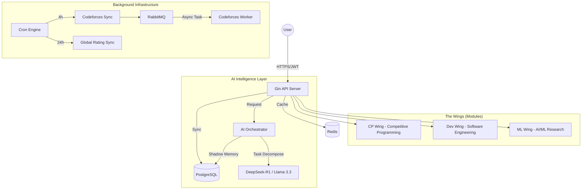
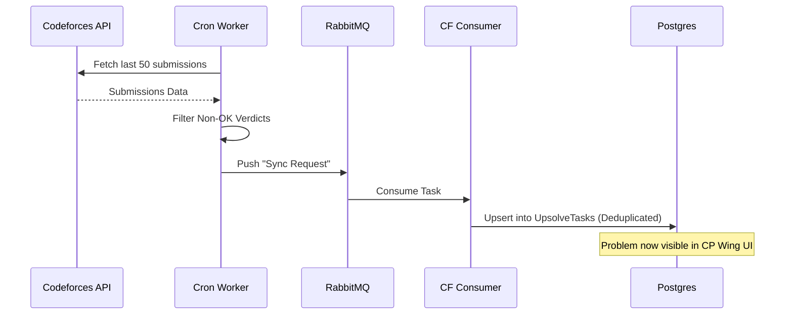
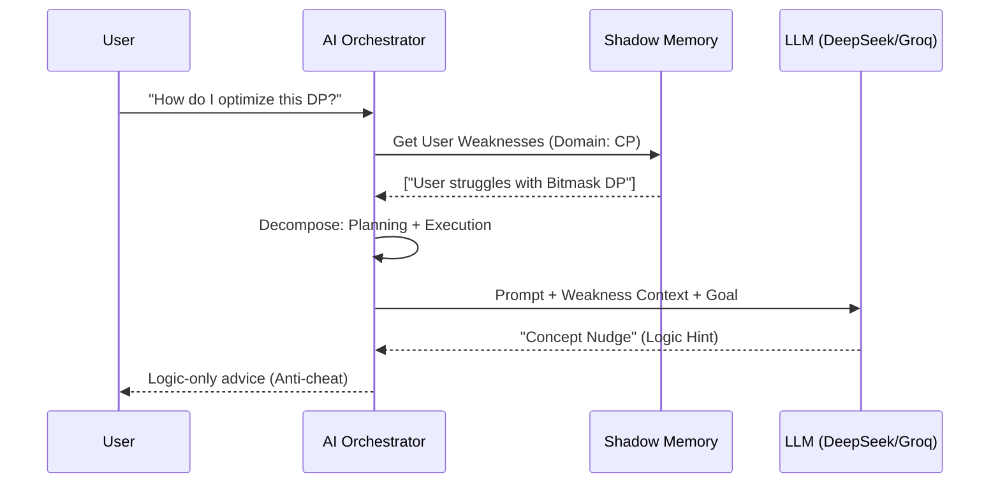

# AXIOS-GO: The Centralized Technical Nexus 🌐

AXIOS-GO is a next-generation, AI-driven platform designed to centralize and optimize the professional growth of developers. It bridges the gap between competitive programming, software engineering, and research-heavy domains like Machine Learning through a unified "Agentic" architecture.

---

## 🏛️ System Design & Architecture

AXIOS-GO is built on a **Decoupled Agentic Architecture**. It separates real-time user interactions from high-latency data synchronization and AI-heavy reasoning tasks.

### 1. Global High-Level Flow


---

## 📂 Repository Blueprint

### Backend (`/backend`)
- **`/controllers`**: HTTP Handlers for AI, CP, Dev, and ML Wings.
- **`/models`**: GORM database schemas (User, ShadowMemory, UpsolveTask, Resource).
- **`/services`**: Core logic including the **AI Orchestrator**, Shadow Memory engine, and Multi-Provider routing.
- **`/workers`**: Background processes including RabbitMQ consumers and `robfig/cron` tasks.
- **`/middleware`**: JWT authentication and security layers.

### Frontend (`/frontend`)
- **`/src/pages`**: Main domain views (AILab, Wrapped, Leaderboard, WingPage).
- **`/src/components/wings`**: Specialized UI for each technical domain.
- **`/src/components/3d`**: Three.js/React Three Fiber visualizations (HeroScene, WrappedBackground).
- **`/src/hooks`**: Custom React hooks for data fetching (e.g., `useWrappedData`).

---

## 🛠️ Core Functional Flows

### 1. The "Upsolve" Pipeline (CP Wing)
This flow ensures that developers never lose track of their failures during competitive programming contests.



### 2. AI Orchestration & Shadow Memory
AXIOS-GO doesn't just "chat"; it **reasons** and **remembers**.



---

## 📊 Database Schema (PostgreSQL)

- **`User`**: Central identity. Stores social handles (CF, GitHub), Wing interests, and calculated ratings.
- **`ShadowMemory`**: Stores a Proficiency score (1-10) for technical concepts. Used by the Orchestrator for personalized nudging.
- **`UpsolveTask`**: Tracks failed CP problems. Includes problem metadata, rating, and status (`pending`, `solved`).
- **`Resource`**: A curated library of technical papers, repositories, and articles, tagged by Wing and difficulty.

---

## 🌟 The Wings (Domain Specifics)

### 🏎️ CP Wing (Competitive Programming)
- **Live Leaderboard**: Real-time ranking based on Codeforces stats.
- **Upsolve Queue**: Your personal "Wall of Shame" converted into a "Path of Growth".
- **Mock Contests**: Dynamic contest generation targeting your specific rating gap.
- **CodeSensei**: AI specialized in algorithmic complexity and logic hints.

### 🏗️ Dev Wing (Software Engineering)
- **Repo Health Audit**: Quantitative analysis of GitHub repositories (README, activity, issue ratio).
- **PR AI Audit**: Security and architectural review of open Pull Requests.
- **Resume STAR Generator**: Transforms technical commit logs into professional career achievements.
- **Good First Issues**: Direct entry points to open-source contributions.

### 🧪 ML Wing (Machine Learning)
- **Concept Lab**: Exploratory research assistant for neural architectures.
- **Curated Learning**: Resource suggestions mapped directly to your Shadow Memory gaps.

---

## 📈 The Axios Rating Algorithm

The ranking system is designed to reward cross-domain versatility.
$$AxiosRating = (CF_{Rating} \times 0.5) + (CF_{Solved} \times 5) + (GH_{Repos} \times 20)$$
- **CF Rating**: Base logic score.
- **Solved Problems**: Consistency reward.
- **GitHub Repos**: Engineering output reward.

---

## 🚀 Setup & Installation

### Environment Variables (`backend/.env`)
```env
DB_HOST=localhost
DB_USER=postgres
DB_PASSWORD=your_password
DB_NAME=axios
JWT_SECRET=your_jwt_secret
GROQ_API_KEY=gsk_...
DEEPSEEK_API_KEY=sk_...
HF_API_TOKEN=hf_...
```

### Installation
1. **Infrastructure**: `docker-compose up -d` (Launches Redis & RabbitMQ).
2. **Backend**: 
   ```bash
   cd backend
   go mod tidy
   go run main.go
   ```
3. **Frontend**:
   ```bash
   cd frontend
   npm install
   npm run dev
   ```

---

## 🎨 Design Philosophy
AXIOS-GO utilizes a **Dark-Aesthetic Glassmorphism** design language.
- **Aesthetics**: Premium, high-contrast UI with neon accents.
- **Motion**: Framer Motion for smooth state transitions and Three.js for 3D technical visualizations.
- **Persona**: The AI behaves as a "Silent Mentor"—providing the logic you need without solving the problem for you.

---
© 2025 AXIOS Technical Nexus. PHASE 1 ONLINE.
