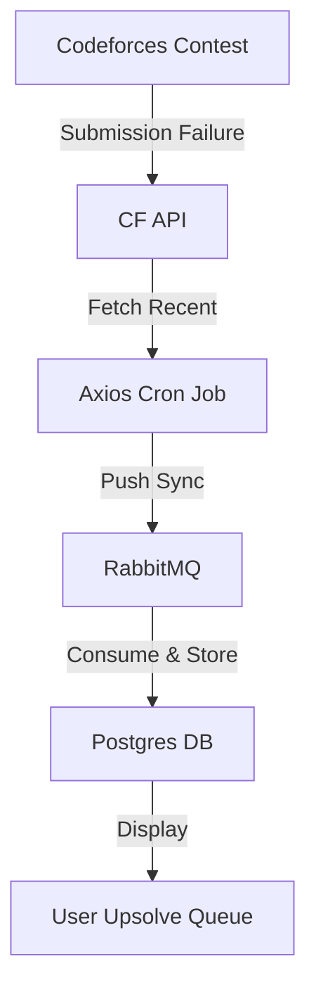
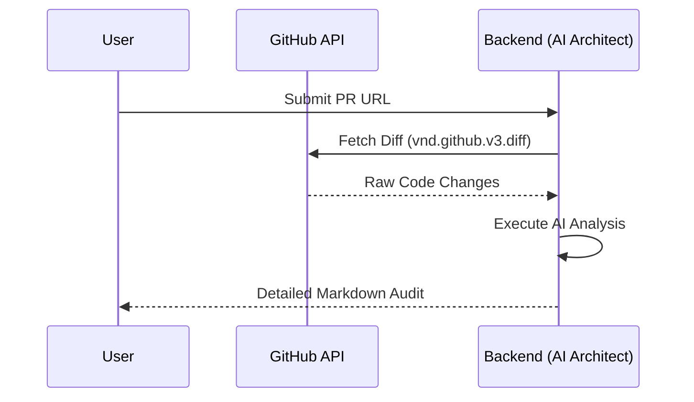
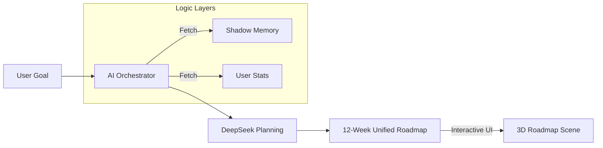

# AXIOS-GO: User Journey & Use Cases

This document outlines the core functional use cases of the AXIOS-GO platform, detailing how different technical "Wings" interact with the user's growth journey.

---

## 1. Competitive Programmer (CP) Journey

### Use Case 1.1: Automated Upsolving
- **Objective**: Never lose track of a failed problem.
- **Actor**: User / Cron Worker.
- **Flow**:
    1. User participates in a Codeforces contest and fails problem "C".
    2. AXIOS-GO background worker fetches the failure during its 4-hour sync cycle.
    3. The problem appears in the user's **Upsolve Queue** with its rating and tags.
    4. User views the queue and sees "C" tagged as "Pending".

### Use Case 1.2: The CodeSensei "Nudge"
- **Objective**: Get help without seeing the solution code.
- **Actor**: User / AI Sub-agent.
- **Flow**:
    1. User clicks "Get Nudge" on a pending Upsolve task.
    2. The AI analyzes the problem and the user's **Shadow Memory** (e.g., "Weak in Dynamic Programming").
    3. The AI provides a hint: "Think about how the state depends on the suffix of the array rather than the prefix."
    4. User implements the logic, submits to CF, and succeeds.
    5. User marks the task as "Solved" in AXIOS-GO.

---

## 2. Software Engineer (Dev) Journey

### Use Case 2.1: Repository Health Audit
- **Objective**: Improve personal project quality.
- **Actor**: User / GitHub API.
- **Flow**:
    1. User links their GitHub handle.
    2. The **Dev Wing** lists their repositories.
    3. User selects a project for a "Health Audit".
    4. The system analyzes the repo for a README, recent commits, and issue management.
    5. User receives a **Health Score (0-100)** and actionable suggestions (e.g., "Add a README to improve accessibility").

### Use Case 2.2: PR AI Review
- **Objective**: Catch bugs and architectural issues before merging.
- **Actor**: User / AI Architect Sub-agent.
- **Flow**:
    1. User pastes a link to an open GitHub Pull Request.
    2. The backend fetches the raw diff of the PR.
    3. The **AI Architect** analyzes the code changes for security vulnerabilities, style issues, and architectural flaws.
    4. User receives a structured review in Markdown.

---

## 3. AI/ML Researcher (ML) Journey

### Use Case 3.1: The Concept Lab
- **Objective**: Deepen understanding of complex architectures.
- **Actor**: User / ML Sub-agent.
- **Flow**:
    1. User enters the **Concept Lab** and asks about "Transformers Attention Mechanism".
    2. The system fetches the user's proficiency in related concepts from **Shadow Memory**.
    3. The AI provides a breakdown tailored to their level, highlighting specific papers or resources.

---

## 4. Cross-Domain Synergy

### Use Case 4.1: The Unified Technical Roadmap
- **Objective**: Chart a path for multi-disciplinary growth.
- **Actor**: User / AI Orchestrator.
- **Flow**:
    1. User requests a roadmap for "Fullstack Dev + Algorithmic Mastery".
    2. The **AI Orchestrator** decomposes this into two domains.
    3. It fetches the user's current Axios Rating and CF/GitHub stats.
    4. It generates a 12-week plan where CP and Dev tasks are intertwined (e.g., "Week 1: Master BFS in CP; Implement a Graph Visualization in React").

### Use Case 4.2: The Global Leaderboard
- **Objective**: Gamify technical growth.
- **Actor**: All Users.
- **Flow**:
    1. The system syncs all user stats every 24 hours.
    2. It calculates the **Axios Rating**.
    3. Users are ranked on a global leaderboard, allowing them to compare their cross-domain versatility with peers.

---
© 2025 AXIOS Technical Nexus.
